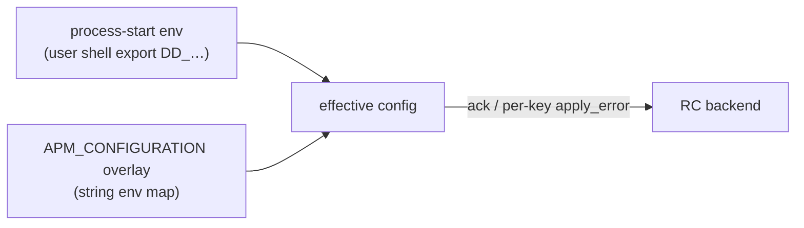

# RFC: `APM_CONFIGURATION` a single Remote Config capability for SDK configuration

- Status: draft
- Scope: dd-trace-js POC + Remote Config backend changes
- Related (wider, cross-language context, out of scope here): `apm-configuration-remote-config/{rfc,backend,matrix,categories,summary}.md`

## Goal

Make all SDK configurations remotely configurable at runtime under a **single** Remote Config capability — `APM_CONFIGURATION` — whose payload is an env-var-keyed, string-valued overlay that the tracer pipes through its existing env-var parser.

## Phase 1 scope

In scope:

- Backend changes required to emit an `APM_CONFIGURATION` payload.
- Backend wiring that pulls each tracer's init-time effective configuration from its `app-started` telemetry event and uses it to serve "unapply" flows (so the tracer no longer needs to track its own init-time snapshot). See Ideal State item #4 and §Scope note on init-time state below.
- Migrating the configurations currently carried over Remote Config (via the `APM_TRACING_`* capability bits) to the new `APM_CONFIGURATION` format, plus one additional new configuration.
- POC in dd-trace-js, including removal of the legacy per-product RC handlers and of `baseValuesByPath` / `undo()` on the tracer side (gated on Q8 below — confirm with backend).
- APM-only configurations.

Out of scope:

- UI changes.
- Changes to other tracing libraries.
- Defining a complete list of the remaining configurations to make remotely configurable.
- Non-APM products (AppSec, profiler, CI Visibility, LLM Observability, etc.).

## Current state

1. Only a small, hand-picked subset of SDK configurations are remotely configurable at runtime.
2. Each remotely-configurable configuration is registered as its **own bit** in the RC capability mask. In dd-trace-js, those bits are enumerated in `[packages/dd-trace/src/remote_config/capabilities.js](packages/dd-trace/src/remote_config/capabilities.js)`, and each is turned on with an explicit `rc.updateCapabilities(...)` call in `[packages/dd-trace/src/config/remote_config.js](packages/dd-trace/src/config/remote_config.js)`. The capability bitmap already carries a `DO NOT ADD ARBITRARY CAPABILITIES` warning and has >30 bits defined.
3. The RC payload uses its own unique configuration key names, distinct from the env-var canonical names (e.g. `tracing_sampling_rate` vs `DD_TRACE_SAMPLE_RATE`). See the `optionLookupTable` in `[packages/dd-trace/src/config/remote_config.js](packages/dd-trace/src/config/remote_config.js)`. Every tracer maintains its own rename table; drift between backend and tracer is inevitable.
4. Because RC keys don't match env-var names, dd-trace-js needs a dedicated transformer (`transformRemoteConfigToLocalOption`) per-field, alongside the lookup table. This is a second code path that re-implements value parsing already present in the env-var pipeline.
5. The tracer stores a snapshot of its "local" init-time effective configuration (from defaults, env vars, stable config) so it can revert to it when an RC value is "unapplied". In dd-trace-js this lives in `changeTracker.baseValuesByPath` in `[packages/dd-trace/src/config/index.js](packages/dd-trace/src/config/index.js)` (see also `undo()` and `setRemoteConfig()` in the same file).
6. RC updates today are modeled as diffs against the current overlay — `toApply`, `toModify`, `toUnapply` — handled in `parseConfig()` in `[packages/dd-trace/src/remote_config/index.js](packages/dd-trace/src/remote_config/index.js)` and dispatched to the per-product batch handler set up in `[packages/dd-trace/src/config/remote_config.js](packages/dd-trace/src/config/remote_config.js)`.

## Ideal state

1. *Eventually*, all¹ SDK configurations are remotely configurable at runtime.
2. All configurations are delivered under a **single** capability — `APM_CONFIGURATION`. The bit only communicates that the tracer can receive a "chunk" of env-var-keyed configuration; it says nothing about *which* keys are acceptable.
3. RC keys are in env-var canonical form (e.g. `DD_TRACE_SAMPLE_RATE`) and values are strings in the same form a user would type them in a shell. One format, one parser.
4. The backend stores the "init-time" configuration and re-sends it if RC is disabled or an overlay is removed. Tracers already emit their effective init-time configuration via the `app-started` telemetry event, so the underlying data is already in the Datadog backend — the RC product side just needs to consume it from telemetry storage and surface it back to tracers on an "unapply". Once that loop is in place, the `toUnapply` action goes away on the tracer side — every tick is an "apply". In dd-trace-js that lets us delete `baseValuesByPath` and the `undo()` machinery in `[packages/dd-trace/src/config/index.js](packages/dd-trace/src/config/index.js)`, and the `toUnapply` branch of the batch handler in `[packages/dd-trace/src/config/remote_config.js](packages/dd-trace/src/config/remote_config.js)`.
5. The tracer reuses the existing env-var apply path. In dd-trace-js that is the private `#applyEnvs(envs, source)` method on `Config` in `[packages/dd-trace/src/config/index.js](packages/dd-trace/src/config/index.js)`, called today with `source = 'env_var' | 'local_stable_config' | 'fleet_stable_config'`. An RC overlay becomes one more caller of that same method with a new source tag (i.e. `'remote_config'`).
6. The payload carries all configuration values under a single capability.

¹ *"All"* meaning all configurations we choose to make remotely configurable. Boot-only / compile-baked keys (full scope to be defined) will simply not be advertised.

## Proposed design

### 1. Single capability `APM_CONFIGURATION`

One new bit in `[capabilities.js](packages/dd-trace/src/remote_config/capabilities.js)`. The product name on the wire is `APM_CONFIGURATION`.

Backward compatibility is negotiated via the capability bit: the backend inspects the tracer's reported capabilities and only sends the new payload shape to tracers that advertise `APM_CONFIGURATION`. Tracers that don't advertise it keep receiving the existing `APM_TRACING` `lib_config` payload. Both paths coexist during the migration window (either indefinite or to be defined in the future); no customer is forced to upgrade.

### 2. Payload shape

Today, each `target_files` entry for `APM_TRACING` looks like:

```json
{
  "id": "…",
  "revision": 1776800694005,
  "schema_version": "v1.0.0",
  "action": "enable",
  "lib_config": {
    "library_language": "all",
    "library_version": "latest",
    "service_name": "mikaylatoffler",
    "env": "prod",
    "tracing_enabled": true,
    "tracing_tags": ["team:my-team"]
  },
  "service_target": {
    "service": "mikaylatoffler",
    "env": "prod"
  }
}
```

What `lib_config` does today: it is a mixed-purpose object that carries both (a) **targeting / identity metadata** for the config record itself — `library_language` (which tracer language(s) this record applies to, e.g. `"all"` or `"nodejs"`), `library_version`, `service_name`, and `env` — and (b) the **actual configuration values** the tracer should apply (`tracing_enabled`, `tracing_tags`, etc.). The targeting metadata is partially redundant with the top-level `service_target`, but both are emitted today. Under `APM_CONFIGURATION` we separate the two: the config values move out to a new top-level map, and the targeting metadata stays where it is useful (primarily `service_target`). Whether `library_language` / `library_version` still need to travel inside the payload under the new product is an open question (see Open questions).

Under `APM_CONFIGURATION`, each entry becomes:

```json
{
  "id": "08bbaf397a39351cde828f9e0df4651218f82ceb8ed4d24b185d21eedb547528",
  "revision": 1776800694005,
  "schema_version": "v1.0.0",
  "action": "enable",
  "config": {
    "DD_TRACE_SAMPLE_RATE": "0.25",
    "DD_LOGS_INJECTION": "true",
    "DD_TAGS": "team:core,env:prod"
  },
  "service_target": { "service": "web", "env": "prod" },
  "meta": {
    "state_version": 172930001,
    "content_sha256": "…",
    "source": "ui"
  }
}
```

Changes from today:

- `**id`** / `**revision`** / `**schema_version`** are existing RC-transport-level fields (unique config identifier, per-record version, payload format version). They are retained unchanged and are shown in the example above to make it clear they are not going away.
- `**action`** is retained during phase 1 only for transport continuity with the legacy product. Once Ideal State item #4 lands (backend stores init-time config and serves it on "unapply", every tick is an "apply"), the enable/disable semantics `action` carries today become redundant with the full-state model described in §5 and the field can be dropped from the `APM_CONFIGURATION` payload. See Concerns §5.
- `**service_target`** already exists and is reused unchanged. The priority-merge logic in `RCClientLibConfigManager.calculatePriority` in `[packages/dd-trace/src/config/remote_config.js](packages/dd-trace/src/config/remote_config.js)` (Service+Env > Service > Env > Cluster > Org) does not change.
- `**config**` is new. It is a flat map of env-var canonical name → string value. **Note on naming**: the original draft called this field `env`. Because today's `lib_config` already has a nested `env` field that means "target environment" (e.g. `"prod"`), reusing `env` at the top level for env-var overlays is a collision. `config` (proposed), or alternatively `env_vars` / `config_env`, avoids that ambiguity. Pick one and document it before wire freeze.
- `**meta`** is new. It carries application-level bookkeeping: `state_version`, `content_sha256`, and `source`. Details below.
- `**lib_config`** is *not* used by the new payload. Its config-value keys (`tracing_enabled`, `tracing_tags`, …) are covered by their env-var equivalents (`DD_TRACE_ENABLED`, `DD_TAGS`, …) inside `config`. Its identity-metadata keys (`library_language`, `library_version`, `service_name`, `env`) are either redundant with `service_target` or — in the case of `library_language` / `library_version` — may still need to be carried somewhere at the top level if the backend uses them for per-language targeting. See Open questions. `lib_config` continues to exist on the old `APM_TRACING` product for legacy clients; this proposal does not touch it there.

Values are always **strings** — the canonical form a user would type in a shell. The tracer pipes each `(name, value)` pair through `#applyEnvs` in `[packages/dd-trace/src/config/index.js](packages/dd-trace/src/config/index.js)`, reusing the existing per-env-var parsers and transformers. The `optionLookupTable` and `transformers` objects in `[packages/dd-trace/src/config/remote_config.js](packages/dd-trace/src/config/remote_config.js)` can then be deleted.

The payload is compressed at the transport layer using the same compression RC already applies to other products; no new compression is introduced.

### 3. `state_version` and `content_sha256`

- `**state_version`**: a monotonically increasing 64-bit integer assigned by the backend on every save, per (org × targeting tier). It documents the logical generation of the overlay. Two concurrent UI edits against the same tier are resolved by "highest `state_version` wins", and the tracer acks `state_version` back to the backend so the backend can detect stuck or flapping clients.
- `**content_sha256`**: the SHA-256 of the overlay payload's canonical bytes, included in `meta`. It has two jobs:
  1. **Idempotent no-op detection on the tracer.** If the incoming payload's `content_sha256` matches the `content_sha256` of the currently-applied overlay, the tracer short-circuits — no re-parse, no re-application. This keeps the hot-path allocation-free on steady-state polls. (This is an *application-level* check. A separate transport-level hash check already exists in `parseConfig()` in `[packages/dd-trace/src/remote_config/index.js](packages/dd-trace/src/remote_config/index.js)` at the `current.hashes.sha256 === meta.hashes.sha256` comparison. The two layers serve different purposes and coexist.)
  2. **Truncation / corruption guard.** The tracer recomputes the SHA-256 of the received payload; a mismatch against the backend-supplied `content_sha256` is treated as a bad payload and rejected. The previously-applied overlay is kept as-is.

### 4. Applying the overlay

On each RC tick:

1. RC transport delivers one `APM_CONFIGURATION` payload per matching targeting tier (as today for `APM_TRACING`).
2. The tracer validates `content_sha256`. Mismatch → reject, keep previous overlay.
3. If `content_sha256` matches the currently-applied overlay's hash → no-op, ack.
4. Otherwise: merge by targeting priority (unchanged from `RCClientLibConfigManager.getMergedLibConfig()` in `[packages/dd-trace/src/config/remote_config.js](packages/dd-trace/src/config/remote_config.js)`), producing one effective env-var map.
5. Call `#applyEnvs(mergedMap, 'remote_config')`. This reuses the full env-var parsing pipeline (parser + transformer + `setAndTrack`) already exercised by process-start env vars.
6. Ack per-key. Keys that failed to parse or apply are reported back via `apply_error` and the rest of the overlay is applied.

### 5. Forward-only full-state updates (vs diff)

Every `APM_CONFIGURATION` update is the **complete desired env map** for its targeting tier. The local process-start env is the base layer; the RC overlay fully replaces the previous RC overlay each tick.




**Why full-state instead of diff?** The backend is the sole writer of this product; there is no second writer we need to reconcile with. A diff-based model would require the tracer to maintain a monotonically-correct reducer, tolerate lost deltas, and order per-key add/modify/remove operations. That is exactly the `toApply` / `toModify` / `toUnapply` complexity we want to retire. Full-state trades payload size for simplicity, and the size increase is bounded by compression (see §Performance).

This also lets us retire `toUnapply` from the `APM_CONFIGURATION` code path entirely: "remove a key from the overlay" becomes "send a full-state update that doesn't contain that key". On the tracer side, once the backend is additionally storing the init-time configuration (ideal state item #4), `baseValuesByPath` and `undo()` in `[packages/dd-trace/src/config/index.js](packages/dd-trace/src/config/index.js)` can also go away.

### 6. Asserting that "all" configs are actually remote-configurable

The config registry in `[packages/dd-trace/src/config/supported-configurations.json](packages/dd-trace/src/config/supported-configurations.json)` gets a new optional field, `remoteConfig`, that points to a per-config test asserting the env var is actually honored when it arrives over RC:

```json
"DD_TAGS": [
  {
    "implementation": "A",
    "type": "map",
    "default": "",
    "configurationNames": ["tags"]
  }
],
"remoteConfig": "packages/dd-trace/test/config/index.spec.js:ddTagsRemoteConfigTest"
```

Where `ddTagsRemoteConfigTest` is the name of the test in `[packages/dd-trace/test/config/index.spec.js](packages/dd-trace/test/config/index.spec.js)` that exercises `DD_TAGS` via the RC path. We need a test per config because each config is used differently in practice — some are read-once, some subscribe to change events, some feed downstream subsystems.

This schema is language-agnostic and can be extended to the other tracing libraries later.

### 7. Validating value types

UI work is out of scope, but we still need to decide where mistyped input is rejected. The backend can validate, or it can defer to the SDKs.

For phase 1 we propose backend validation of three scalar types: `int`, `float`, `bool`. These are trivial to validate server-side without a language-specific parser. Strings are deferred — many tracer "string" configs are actually enums (e.g. propagation styles), and validating them properly requires either a more involved schema or a more elaborate UI that prevents invalid input up-front. Strings and all other types are out of scope for this phase; the eventual UI should make invalid values near-impossible to submit, and whatever slips through gets reported back via the SDK's existing per-key `apply_error` telemetry — which the backend ingests and the UI can render next to the offending value.

## Backward compatibility

- The backend checks whether the tracer reports the `APM_CONFIGURATION` capability bit. If yes → send the new payload. If no → keep sending the legacy `APM_TRACING` `lib_config`.
- Legacy client-side handlers (the `optionLookupTable`, `transformers`, per-bit `rc.updateCapabilities(...)` calls, `setBatchHandler(['APM_TRACING'], ...)`) are **removed** in the same tracer release that ships the `APM_CONFIGURATION` capability. Any tracer version that advertises `APM_CONFIGURATION` is exclusively on the new path; it does not need the legacy handlers, since the backend (per the bullet above) will only send it the new payload. This is safe because versioning handles the mixed fleet: older tracers, which do not advertise the new capability, are still shipped with the old handlers baked in and continue to receive the legacy payload.
- No customer is forced to upgrade. Older tracer majors keep receiving legacy-shaped payloads indefinitely; the backend retains the legacy emission path for as long as fleet telemetry shows legacy-only tracers in use.

## Failure modes

- **RC agent outage.** The tracer keeps its last-known-good overlay in memory, so steady-state configuration does not flap when the agent is briefly unreachable. It is *not* persisted to disk — on a process restart, the tracer starts from its base env and waits for the next successful RC poll to re-apply the overlay.
- **Partial or truncated payload.** The tracer recomputes `content_sha256` on the received bytes; a mismatch against `meta.content_sha256` causes the payload to be rejected and the previously-applied overlay to be kept. This is specifically guarding against transport-layer truncation that slips past the RC framing.
- **Invalid value for a known env var.** The offending key is dropped, `apply_error` is populated for that key, and the rest of the overlay applies. This matches today's per-key-fail-open behavior and will be preserved.
- **Unknown env var in the overlay.** The tracer ignores it with a warning log and a per-key `apply_error` in telemetry. This can happen during fleet skew — e.g. the backend is aware of a key the tracer version doesn't yet understand.

## Security

The overlay is opaque to user code (applied by the tracer, not by the application). Every value is validated by the existing env parser (same `allowed`, `type`, and `transform` as a shell-set env var).

**Secret deny-list (design, implementation deferred past phase 1).** Secret env vars — `DD_API_KEY`, tokens, `DD_*_AUTH_`*, proxy URLs that may carry credentials — MUST never traverse RC. The intended design enforces this in **two places** (defense in depth, so a bug in one layer cannot leak credentials into the payload):

1. At the **backend write path** — i.e. the code that handles a UI save and writes the overlay into RC storage before the agent ever ships it down to SDKs. An overlay containing a denied key is rejected at the API layer with a structured error; no partial write. This is the ingress point, not the telemetry-ingest point — SDK-emitted `apply_error` telemetry is a separate pipeline.
2. At the **tracer apply path**. On apply, the tracer rejects any key matching the deny-list before calling `#applyEnvs`.

**Why this is deferred.** Phase 1 will not include a sensitive/secret configuration key in the POC — the migrated set (the existing `APM_TRACING_`* configs + one new one) does not touch credentials or secrets. Because there is no way for a denied key to appear in a phase 1 overlay, implementing the deny-list is not blocking for phase 1 and is scheduled as **future work**, to be completed before any sensitive-key configuration is ever advertised under `APM_CONFIGURATION`.

Deny-list patterns (minimum set for when this is implemented):

- `DD_API_KEY`, `DD_APP_KEY`, `DD_APPLICATION_KEY`, `DATADOG_API_KEY`
- `DD_*_TOKEN`, `DD_*_PASSWORD`, `DD_*_SECRET`, `DD_*_AUTH`*
- `DD_*_API_KEY_FILE`, `DD_*_APPLICATION_KEY_FILE`
- `DD_PROXY_`* (credentials can be embedded in URL)
- Platform SDK creds: `AWS_`*, `AZURE_`*, `GOOGLE_APPLICATION_*`

## Performance & efficiency

- **One decode per poll** (instead of one per product). One parse pass reuses the existing env-parsing code, which reduces RC-path allocations in dd-trace-js.
- **Capability bitmap stops growing.** A single bit amortizes all future runtime-mutable configs. The backend retires a set of per-feature schema routes; dd-trace-js retires `optionLookupTable` and its transformers.
- **Payload size (unverified estimate).** A per-target payload range of ~500 B – 4 KB compressed was referenced in the broader cross-language RFC (`apm-configuration-remote-config/backend.md`, §Performance) as a back-of-envelope expectation for realistic overlays, versus ~500 B for today's `APM_TRACING` `lib_config`. That number has **not** been independently benchmarked for dd-trace-js in this RFC; treat it as an order-of-magnitude guide, not a budget. A real measurement under the phase 1 scope is an action item before we quote it to reviewers.

## Concerns and remediations

### 1. New payload will be much larger than the old payload

Applies under the forward-only full-state model (§5). Full overlays rather than diffs means every poll resends the entire env map for the targeting tier.

**Remediation.** The existing RC transport-level compression is expected to be sufficient at the phase 1 scope (≤ current `APM_TRACING` surface + 1 new key). If real-world overlays start approaching tens of keys, we can revisit — options include a per-key diff layer or more aggressive compression on the transport.

### 2. Capability manifest (follow-up, not phase 1)

Longer term, the tracer should publish a machine-readable list of which env vars it will actually honor at runtime (the "capability manifest"). Without it, the backend has no way to know which keys are safe to include in an overlay for a given tracer version. Phase 1 punts on this: the initial migrated set is well-known, and the backend ships the same overlay shape to every advertising tracer.

### 3. Mixed tracer versions within a single target

A service's running instances may include some tracer versions that advertise `APM_CONFIGURATION` and some that don't (e.g. during a rolling deploy, or when multiple services share a config target). Phase 1 handles this via the capability bit (see Backward compatibility) — advertising instances receive the new payload, non-advertising instances keep receiving the legacy `APM_TRACING` `lib_config`. No UI-side handling is required for phase 1.

### 4. Unknown keys in an overlay

If the backend emits an env var a tracer version doesn't recognize, the tracer should log-and-ignore rather than fail the whole overlay. Already covered by the existing `apply_error` mechanism; documented here as an explicit design point so we don't regress it.

### 5. Init-time state storage on the backend

Ideal state item #4 — backend stores init-time config, tracer stops tracking its own revert state — is **proposed as in scope for phase 1**, subject to backend-team confirmation (Q8). The underlying data is already available server-side: every tracer emits its effective init-time configuration via the `app-started` telemetry event. The work on the backend is to have the RC product read that data from telemetry storage and serve it back to the tracer whenever an overlay is cleared or RC is disabled, eliminating the need for the SDK to keep its own snapshot.

On the tracer side, once the backend end is in place, the following can be deleted in dd-trace-js:

- `baseValuesByPath` and `undo()` in `[packages/dd-trace/src/config/index.js](packages/dd-trace/src/config/index.js)`.
- The `toUnapply` branch of the batch handler in `[packages/dd-trace/src/config/remote_config.js](packages/dd-trace/src/config/remote_config.js)`.

On the wire, the `action` field on the payload (see §Payload shape) also becomes redundant at the same point — every tick is an "apply", so `action: "enable"` / `"disable"` carries no information the full-state overlay doesn't already imply. It can be dropped from the `APM_CONFIGURATION` payload at the same time.

If the backend work does not land within the phase 1 window, we ship phase 1 without these deletions — `APM_CONFIGURATION` simply layers on top of the existing revert machinery, `action` stays on the wire, and the cleanup slips to a follow-up.

## References to existing code

Paths verified against the current tree on `mtoff/rc-draft`.

- RC capability bitmap: `[packages/dd-trace/src/remote_config/capabilities.js](packages/dd-trace/src/remote_config/capabilities.js)`
- RC client (polling, `parseConfig`, transport-level hash dedup): `[packages/dd-trace/src/remote_config/index.js](packages/dd-trace/src/remote_config/index.js)`
- Per-product handler registration + `optionLookupTable` + `transformers` + `RCClientLibConfigManager`: `[packages/dd-trace/src/config/remote_config.js](packages/dd-trace/src/config/remote_config.js)`
- Env-var apply pipeline (`#applyEnvs`, `setRemoteConfig`, `undo`, `baseValuesByPath`): `[packages/dd-trace/src/config/index.js](packages/dd-trace/src/config/index.js)`
- Config registry (where `remoteConfig` field will be added): `[packages/dd-trace/src/config/supported-configurations.json](packages/dd-trace/src/config/supported-configurations.json)`
- Sample legacy RC payload: `[rc-sample.json](rc-sample.json)`

## Open questions (for reviewers)

- **Payload field name.** Proposal above uses `config`. Alternative preferences are welcome.
- **Field to omit from the new payload.** The legacy `lib_config` object carries `library_language`, `library_version`, `service_name`, and `env` alongside the config values. Under `APM_CONFIGURATION` these are redundant with `service_target` + the RC transport headers. Propose dropping them; confirm with backend before finalizing.
- **Where does the client-side deny-list live?** Centralized helper in `remote_config/`, or inline in `#applyEnvs`? First is cleaner for reuse across non-APM products later.
- **Which single new configuration ships in phase 1?** The RFC says "plus one additional, new configuration"; the specific one is not yet chosen here. Need input from dd-trace-js team.
- **Q8 — Init-time config via `app-started` telemetry, in phase 1?** This RFC proposes that the RC backend pulls init-time effective configuration from the `app-started` telemetry event and uses it to serve overlay-removal / RC-disabled cases, letting the tracer drop `baseValuesByPath` and `undo()`. Is this tractable for the backend team in the phase 1 timeline, or should it slip to a follow-up? (See Concerns §5.)
- `**library_language` / `library_version` under `APM_CONFIGURATION`.** Today they ride inside `lib_config` and are used for per-language targeting. Does the backend still need them at the payload level under the new product, or are they subsumed by the tracer's capability bit + client-state `client_tracer.language` / `tracer_version` fields already reported on every RC poll?

