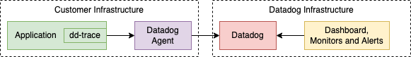

# `dd-trace`: Node.js APM Tracer Library

[](https://www.npmjs.com/package/dd-trace)
[](https://codecov.io/gh/DataDog/dd-trace-js)


`dd-trace` is an npm package that you can install in your Node.js application to capture APM (Application Performance Monitoring) data. In Datadog terminology this library is called a Tracer. This data is then sent off to a process which collects and aggregates the data, called an Agent. Finally the data is sent off to the Datadog servers where it's stored and made available for querying in a myriad of ways, such as displaying in a dashboard or triggering alerts.




## Documentation

Most of the documentation for `dd-trace` is available on these webpages:

- [Tracing Node.js Applications](https://docs.datadoghq.com/tracing/languages/nodejs/) - most project documentation, including setup instructions
- [Configuring the Node.js Tracing Library](https://docs.datadoghq.com/tracing/trace_collection/library_config/nodejs) - environment variables and config options
- [API Documentation](https://datadog.github.io/dd-trace-js) - method signatures, plugin list, and some usage examples
- [APM Terms and Concepts](https://docs.datadoghq.com/tracing/visualization/) - a glossary of concepts applicable across all languages


## Version Release Lines and Maintenance

> **Node.js v24 Notice**: We're currently adding compatibility for Node.js v24. To use the tracer with your application either continue to use Node.js v22 (LTS), or do both of the following as a workaround:
> * Install v5.52.0 (or newer) of the tracer
> * Set `--no-async-context-frame` either using a CLI argument or via `NODE_OPTIONS`
> Once support for Node.js v24 is complete this flag will no longer be needed.

| Release Line                                             | Latest Version                                                                                         | Node.js  | [SSI](https://docs.datadoghq.com/tracing/trace_collection/automatic_instrumentation/single-step-apm/?tab=linuxhostorvm) | [K8s Injection](https://docs.datadoghq.com/tracing/trace_collection/library_injection_local/?tab=kubernetes) |Status          |Initial Release | End of Life |
| :---:                                                    | :---:                                                                                                  | :---:    | :---:  | :---:  | :---:           | :---:          | :---:       |
| [`v1`](https://github.com/DataDog/dd-trace-js/tree/v1.x) |      | `>= v12` | NO | NO | **EOL** | 2021-07-13     | 2022-02-25  |
| [`v2`](https://github.com/DataDog/dd-trace-js/tree/v2.x) |  | `>= v12` | NO | NO | **EOL** | 2022-01-28     | 2023-08-15  |
| [`v3`](https://github.com/DataDog/dd-trace-js/tree/v3.x) |  | `>= v14` | NO | YES | **EOL** | 2022-08-15     | 2024-05-15  |
| [`v4`](https://github.com/DataDog/dd-trace-js/tree/v4.x) |  | `>= v16` | YES | YES | **EOL**     | 2023-05-12     | 2025-01-11     |
| [`v5`](https://github.com/DataDog/dd-trace-js/tree/v5.x) |         | `>= v18` | YES | YES | **Current**     | 2024-01-11     | Unknown     |

* EOL = End-of-life
* SSI = Single-Step Install

We currently maintain one release line, namely `v5`.

For any new projects it is recommended to use the `v5` release line:

```sh
$ npm install dd-trace
$ yarn add dd-trace
```

Existing projects that need to use EOL versions of Node.js may continue to use these older release lines.
This is done by specifying the version when installing the package.

```sh
$ npm install dd-trace@4 # or whatever version you need
$ yarn add dd-trace@4 # or whatever version you need
```

Note, however, that the end-of-life release lines are no longer maintained and will not receive updates.

Any backwards-breaking functionality that is introduced into the library will result in an increase of the major version of the library and therefore a new release line.
Such releases are kept to a minimum to reduce the pain of upgrading the library.

When a new release line is introduced the previous release line then enters maintenance mode where it will receive updates for the next year.
Once that year is up the release line enters End of Life and will not receive new updates.
The library also follows the Node.js LTS lifecycle wherein new release lines drop compatibility with Node.js versions that reach end-of-life (with the maintenance release line still receiving updates for a year).

For more information about library versioning and compatibility, see the [Node.js Compatibility Requirements](https://docs.datadoghq.com/tracing/trace_collection/compatibility/nodejs/#releases) page.

Changes associated with each individual release are documented on the [GitHub Releases](https://github.com/DataDog/dd-trace-js/releases) screen.


## Development and Contribution

Please read the [CONTRIBUTING.md](https://github.com/DataDog/dd-trace-js/blob/master/CONTRIBUTING.md) document before contributing to this open source project.


## ECMAScript Modules (ESM) Support

ESM support requires an _additional_ command line argument when starting the Node.js process.
For more information, see the [section on ESM support](https://docs.datadoghq.com/tracing/trace_collection/automatic_instrumentation/dd_libraries/nodejs/#esm-applications-only-import-the-loader) in the Node.js tracer documentation.


## Serverless / Lambda

Note that there is a separate Lambda project, [datadog-lambda-js](https://github.com/DataDog/datadog-lambda-js), that is responsible for enabling metrics and distributed tracing when your application runs on Lambda.
That project does depend on the `dd-trace` package but also adds a lot of Lambda-related niceties.
If you find any issues specific to Lambda integrations then the issues may get solved quicker if they're added to that repository.
That said, even if your application runs on Lambda, any core instrumentation issues not related to Lambda itself may be better served by opening an issue in this repository.
Regardless of where you open the issue, someone at Datadog will try to help.


## Bundling

If you would like to trace your bundled application then please read this page on [bundling and dd-trace](https://docs.datadoghq.com/tracing/trace_collection/automatic_instrumentation/dd_libraries/nodejs/#bundling). It includes information on how to use our ESBuild plugin and includes caveats for other bundlers.


## Security Vulnerabilities

Please refer to the [SECURITY.md](https://github.com/DataDog/dd-trace-js/blob/master/SECURITY.md) document if you have found a security issue.


## Datadog With OpenTelemetery

Please refer to the [Node.js Custom Instrumentation using OpenTelemetry API](https://docs.datadoghq.com/tracing/trace_collection/custom_instrumentation/nodejs/otel/) document. It includes information on how to use the OpenTelemetry API with dd-trace-js.

Note that our internal implementation of the OpenTelemetry API is currently set within the version range `>=1.0.0 <1.9.0`. This range will be updated at a regular cadence therefore, we recommend updating your tracer to the latest release to ensure up to date support.
