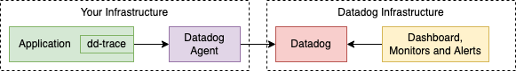

# `dd-trace`: Node.js APM Tracer Library

[](https://www.npmjs.com/package/dd-trace)
[](https://www.npmjs.com/package/dd-trace/v/latest-node12)
[](https://codecov.io/gh/DataDog/dd-trace-js)


`dd-trace` is an npm package that you can install in your Node.js application to capture APM (Application Performance Monitoring) data. In Datadog terminology this library is called a Tracer. This data is then sent off to a process which collects and aggregates the data, called an Agent. Finally the data is sent off to the Datadog servers where it's stored and made available for querying in a myriad of ways, such as displaying in a dashboard or triggering alerts.




## Documentation

Most of the documentation for `dd-trace` is available on these webpages:

- [Tracing Node.js Applications](https://docs.datadoghq.com/tracing/languages/nodejs/) - most project documentation, including setup instructions
- [Configuring the NodeJS Tracing Library](https://docs.datadoghq.com/tracing/trace_collection/library_config/nodejs) - environment variables and config options
- [API Documentation](https://datadog.github.io/dd-trace-js) - method signatures, plugin list, and some usage examples
- [APM Terms and Concepts](https://docs.datadoghq.com/tracing/visualization/) - a glossary of concepts applicable across all languages


## Version Release Lines and Maintenance

| Release Line                                             | Latest Version                                                                                         | Node.js  | Status          |Initial Release | End of Life |
| :---:                                                    | :---:                                                                                                  | :---:    | :---:           | :---:          | :---:       |
| [`v1`](https://github.com/DataDog/dd-trace-js/tree/v1.x) |      | `>= v12` | **End of Life** | 2021-07-13     | 2022-02-25  |
| [`v2`](https://github.com/DataDog/dd-trace-js/tree/v2.x) |  | `>= v12` | **End of Life** | 2022-01-28     | 2023-08-15  |
| [`v3`](https://github.com/DataDog/dd-trace-js/tree/v3.x) |  | `>= v14` | **Maintenance** | 2022-08-15     | 2024-05-15  |
| [`v4`](https://github.com/DataDog/dd-trace-js/tree/v4.x) |         | `>= v16` | **Current**     | 2023-05-12     | Unknown     |

We currently maintain two release lines, namely `v3` and `v4`.
Features and bug fixes that are merged are released to the `v4` line and, if appropriate, also the `v3` line.

For any new projects it is recommended to use the `v4` release line:

```sh
$ npm install dd-trace
$ yarn add dd-trace
```

However, existing projects that already use the `v3` release line, or projects that need to support EOL versions of Node.js, may continue to use these release lines.
This is done by specifying the version when installing the package.

```sh
$ npm install dd-trace@3
$ yarn add dd-trace@3
```

Any backwards-breaking functionality that is introduced into the library will result in an increase of the major version of the library and therefore a new release line.
Such releases are kept to a minimum to reduce the pain of upgrading the library.

When a new release line is introduced the previous release line then enters maintenance mode where it will receive updates for the next year.
Once that year is up the release line enters End of Life and will not receive new updates.
The library also follows the Node.js LTS lifecycle wherein new release lines drop compatibility with Node.js versions that reach end of life (with the maintenance release line still receiving updates for a year).

For more information about library versioning and compatibility, see the [NodeJS Compatibility Requirements](https://docs.datadoghq.com/tracing/trace_collection/compatibility/nodejs/#releases) page.

Changes associated with each individual release are documented on the [GitHub Releases](https://github.com/DataDog/dd-trace-js/releases) screen.


## Development

Before contributing to this open source project, read our [CONTRIBUTING.md](https://github.com/DataDog/dd-trace-js/blob/master/CONTRIBUTING.md).


## Requirements

Since this project supports multiple Node versions, using a version
manager such as [nvm](https://github.com/creationix/nvm) is recommended.

We use [yarn](https://yarnpkg.com/) for its workspace functionality, so make sure to install that as well.

To install dependencies once you have Node and yarn installed, run:

```sh
$ yarn
```


## Testing

Before running _plugin_ tests, the data stores need to be running.
The easiest way to start all of them is to use the provided
docker-compose configuration:

```sh
$ docker-compose up -d -V --remove-orphans --force-recreate
$ yarn services
```

> **Note**
> The `couchbase`, `grpc` and `oracledb` instrumentations rely on native modules
> that do not compile on ARM64 devices (for example M1/M2 Mac) - their tests
> cannot be run locally on these devices.

### Unit Tests

There are several types of unit tests, for various types of components. The
following commands may be useful:

```sh
# Tracer core tests (i.e. testing `packages/dd-trace`)
$ yarn test:trace:core
# "Core" library tests (i.e. testing `packages/datadog-core`
$ yarn test:core
# Instrumentations tests (i.e. testing `packages/datadog-instrumentations`
$ yarn test:instrumentations
```

Several other components have test commands as well. See `package.json` for
details.

To test _plugins_ (i.e. components in `packages/datadog-plugin-XXXX`
directories, set the `PLUGINS` environment variable to the plugin you're
interested in, and use `yarn test:plugins`. If you need to test multiple
plugins you may separate then with a pipe (`|`) delimiter. Here's an
example testing the `express` and `bluebird` plugins:

```sh
PLUGINS="express|bluebird" yarn test:plugins
```


### Memory Leaks

To run the memory leak tests, use:

```sh
$ yarn leak:core

# or

$ yarn leak:plugins
```


### Linting

We use [ESLint](https://eslint.org) to make sure that new code
conforms to our coding standards.

To run the linter, use:

```sh
$ yarn lint
```


### Experimental ESM Support

> **Warning**
> 
> ESM support has been temporarily disabled starting from Node 20 as significant
> changes are in progress.

ESM support is currently in the experimental stages, while CJS has been supported
since inception. This means that code loaded using `require()` should work fine
but code loaded using `import` might not always work.

Use the following command to enable experimental ESM support with your application:

```sh
node --loader dd-trace/loader-hook.mjs entrypoint.js
```


### Benchmarks

Our microbenchmarks live in `benchmark/sirun`. Each directory in there
corresponds to a specific benchmark test and its variants, which are used to
track regressions and improvements over time.

In addition to those, when two or more approaches must be compared, please write
a benchmark in the `benchmark/index.js` module so that we can keep track of the
most efficient algorithm. To run your benchmark, use:

```sh
$ yarn bench
```


## Serverless / Lambda

Note that there is a separate Lambda project, [datadog-lambda-js](https://github.com/DataDog/datadog-lambda-js), that is responsible for enabling metrics and distributed tracing when your application runs on Lambda.
That project does depend on the `dd-trace` package but also adds a lot of Lambda-related niceties.
If you find any issues specific to Lambda integrations then the issues may get solved quicker if they're added to that repository.
That said, even if your application runs on Lambda, any core instrumentation issues not related to Lambda itself may be better served by opening an issue in this repository.
Regardless of where you open the issue, someone at Datadog will try to help.


## Bundling

Generally, `dd-trace` works by intercepting `require()` calls that a Node.js application makes when loading modules. This includes modules that are built-in to Node.js, like the `fs` module for accessing the filesystem, as well as modules installed from the npm registry, like the `pg` database module.

Also generally, bundlers work by crawling all of the `require()` calls that an application makes to files on disk, replacing the `require()` calls with custom code, and then concatenating all of the resulting JavaScript into one "bundled" file. When a built-in module is loaded, like `require('fs')`, that call can then remain the same in the resulting bundle.

Fundamentally APM tools like `dd-trace` stop working at this point. Perhaps they continue to intercept the calls for built-in modules but don't intercept calls to third party libraries. This means that by default when you bundle a `dd-trace` app with a bundler it is likely to capture information about disk access (via `fs`) and outbound HTTP requests (via `http`), but will otherwise omit calls to third party libraries (like extracting incoming request route information for the `express` framework or showing which query is run for the `mysql` database client).

To get around this, one can treat all third party modules, or at least third party modules that the APM needs to instrument, as being "external" to the bundler. With this setting the instrumented modules remain on disk and continue to be loaded via `require()` while the non-instrumented modules are bundled. Sadly this results in a build with many extraneous files and starts to defeat the purpose of bundling. 

For these reasons it's necessary to have custom-built bundler plugins. Such plugins are able to instruct the bundler on how to behave, injecting intermediary code and otherwise intercepting the "translated" `require()` calls. The result is that many more packages are then included in the bundled JavaScript file. Some applications can have 100% of modules bundled, however native modules still need to remain external to the bundle.

### ESBuild Support

This library provides experimental ESBuild support in the form of an ESBuild plugin. Require the `dd-trace/esbuild` module when building your bundle to enable the plugin.

Here's an example of how one might use `dd-trace` with ESBuild:

```javascript
const ddPlugin = require('dd-trace/esbuild')
const esbuild = require('esbuild')

esbuild.build({
  entryPoints: ['app.js'], 
  bundle: true,
  outfile: 'out.js',
  plugins: [ddPlugin],
  platform: 'node', // allows built-in modules to be required
  target: ['node16']
}).catch((err) => {
  console.error(err)
  process.exit(1)
})
```


## Security Vulnerabilities

If you have found a security issue, please contact the security team directly at [security@datadoghq.com](mailto:security@datadoghq.com).
