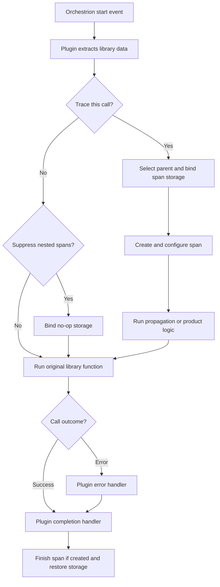
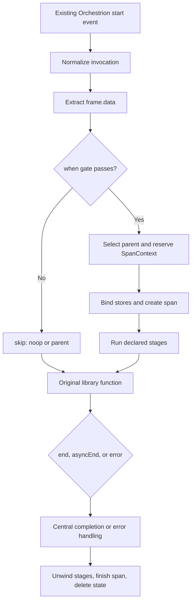
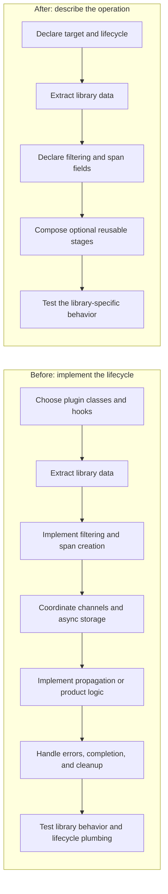

# Integration Pipeline overview

The Integration Pipeline is a simpler way to build dd-trace integrations. An integration declares what is unique
about a library operation; the pipeline handles the common tracing lifecycle behind the scenes.

It is currently an internal architecture experiment, not a public API.

## The problem

An integration observes calls made to a third-party library and turns them into Datadog spans. Orchestrion already
observes those calls and publishes lifecycle events. On the plugin side, however, every integration has traditionally
implemented much of the same machinery itself.

### Before: every plugin managed its own lifecycle



This representative flow was implemented separately by each plugin. The details varied, but every implementer had to
coordinate channel subscriptions, span creation, async context, errors, completion, and cleanup. This mixed
library-specific behavior with tracer plumbing and made similar integrations easy to implement differently.

## The new approach

The plugin declares the operation-specific behavior, and `createIntegrationPlugin()` generates the plugin class and
owns the lifecycle.



A definition focuses on the parts that make an operation different:

```js
{
  target: { module: '@azure/cosmos', name: 'executePlugins' },
  lifecycle: 'async',
  extract: { start: getSpanData },
  when: frame => shouldTrace(frame),
  span: {
    name: 'cosmosdb.query',
    resource: frame => frame.data.resource,
    tags: frame => frame.data.tags,
  },
}
```

This says where the operation comes from, what data it needs, when it should produce a span, and what that span looks
like. The pipeline supplies the channel wiring, context propagation, span lifecycle, error handling, and cleanup.

## What the integration author does



The author still decides what correct instrumentation means for the library. The pipeline takes ownership of how that
decision is executed safely across the common lifecycle.

## Composable building blocks

More complex integrations compose reusable stages for capabilities such as trace propagation or Data Streams
Monitoring. A stage declares whether it requires a recording span, and the pipeline runs it at the correct point.

A capability is shared, not copied. Propagation and Data Streams need the same three answers from any messaging
library — which messages does this call handle, where does each one carry its Datadog fields, and how large is its
payload — so an integration declares that once and the pipeline supplies both capabilities:

```js
createMessagingStage({
  direction: 'out',
  system: 'bullmq',
  topic: field('queueName'),
  messages: frame => [ensureQueueOpts(frame.invocation)],
  commit: commitCarrier,
  payload: (opts, frame) => frame.data.data,
})
```

The integration describes only what is specific to the library. The pipeline owns what neither the library nor the
integration should decide: the Data Streams edge-tag format, the pathway encoding, the configuration gate, the order in
which injection and encoding run, and the fact that both write one shared carrier. A second messaging integration
supplies a different `messages` accessor and reuses the rest, so the wire format cannot drift between integrations.

Each invocation gets a `frame`, a small shared workspace containing:

- the original call arguments, result, or error;
- normalized integration data;
- integration configuration;
- narrow capabilities for correlation, propagation, tagging, and Data Streams Monitoring.

Stages share data through the frame without reaching into the plugin, tracer internals, or raw span.

## Why this is better

| Before | With the Integration Pipeline |
| --- | --- |
| Lifecycle logic repeated across plugin classes | One shared lifecycle engine |
| Library behavior mixed with tracer plumbing | Declarations focus on library behavior |
| Ordering and cleanup enforced by convention | Ordering and cleanup enforced centrally |
| Product code often depends directly on a span | Stages request narrow, explicit capabilities |
| New behavior can require another subclass | Operations assemble reusable stages |
| Each integration hand-wrote its own propagation and Data Streams code | Both derive from one message declaration |
| Lifecycle fixes must be repeated | Shared fixes benefit every migrated integration |

The result is less code for integration authors, more consistent behavior across integrations, and one place to test
and optimize the difficult lifecycle mechanics.

The pipeline also compiles each declaration into an execution plan. It installs only the storage and capabilities an
operation declares, so simple or rejected operations avoid unrelated work.

## What stays the same

- Orchestrion still observes library functions.
- Diagnostic channels still separate instrumentation from plugin behavior.
- Existing plugin loading and configuration still work.
- Each integration still owns its span names, resources, tags, filtering, propagation rules, and other library-specific
  semantics.

The change is ownership: integration authors describe the behavior, while the pipeline consistently orchestrates how
that behavior runs.

## Why the initial scope is Orchestrion

The pipeline is designed around a stable function invocation with a uniform `start`, `end`, `asyncEnd`, and `error`
lifecycle. Orchestrion supplies that shape directly, including the original arguments, receiver, result, and error,
without requiring each integration to maintain a runtime wrapper.

The source adapter keeps channel naming and invocation normalization out of the engine, but it is not a claim that
every shimmer integration belongs in the pipeline. Shimmer is used precisely for cases that often break the standard
operation model: dynamically-created methods, mutation that must happen before lifecycle subscribers run, streaming
or callback ownership, and results whose identity cannot be substituted. Forcing those cases into a source adapter
would move bespoke plugin logic into the adapter and recreate the problem the pipeline is meant to solve.

A shimmer source is a reasonable candidate only when it can expose the same bounded invocation lifecycle without
integration-specific control flow. Otherwise it should remain on the existing plugin model until a reusable lifecycle
or capability is proven by more than one integration.

## What happens to composite plugins

The pipeline removes `CompositePlugin` when the composite exists only to collect several operations for one
integration. BullMQ previously needed separate producer and consumer plugin classes because each class owned its own
subscriptions and lifecycle; its four operations now live in one definition and share stages directly.

That does not make every composite obsolete. A composite may still coordinate independent products, distinct
configuration domains, or genuinely different source lifecycles. Folding those concerns into one pipeline definition
would regress to plugin-style orchestration hidden inside extractors or stages. The useful test is whether the children
share the pipeline lifecycle and differ only in declared operation facts—not whether they happen to share a package ID.

## Current scope

BullMQ proves that four operations with different payload shapes can share one propagation and Data Streams capability.
Azure Cosmos proves that the same engine can combine schema-aware service naming with reusable outbound stages without
selecting a specialized plugin base. The design is still being evaluated for more lifecycle shapes and hotter
integrations before broader adoption.

The messaging capability is shared inside BullMQ but has only one integration as a consumer, so its declaration shape
stays provisional until a second messaging library confirms it.

## Further reading

- [BullMQ mechanical walkthrough](../packages/datadog-plugin-bullmq/INTEGRATION_PIPELINE_NOTES.md)
- [Integration Pipeline rationale and trade-offs](../packages/datadog-plugin-bullmq/INTEGRATION_PIPELINE_RATIONALE.md)
- [Integration Pipeline implementation guide](../packages/dd-trace/src/plugins/integration-pipeline-agent-guide.md)
