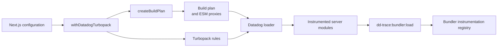

# Turbopack instrumentation

The Turbopack integration instruments server dependencies during a Next.js build.
See the [root README](../../README.md#bundling) for setup instructions.

## Flow

## Configuration phase

`withDatadogTurbopack` resolves Next.js from the application project directory.
It preserves the supplied configuration and appends Datadog rules once.
It does not create build artifacts during the production server phase.

`createBuildPlan` loads the existing instrumentation declarations.
It scans package boundaries in the project and the effective Next.js tracing root.
This scan includes nested dependencies, linked workspaces, and pnpm virtual stores.
An isolated Node.js process resolves package entry points with both `import` and `require` conditions.

The planner hashes each target source file.
It records source dependencies that determine ESM exports and creates an ESM proxy when required.
The plan stores compiler paths, target metadata, and expected source hashes.

The planner writes each proxy and plan below `node_modules/.cache`, where Turbopack can resolve proxy imports.
Each artifact has a content-addressed filename.
An exclusive hard link publishes a complete artifact after its temporary file is ready.
Concurrent configuration calls can therefore share the same artifacts.
The loader verifies plan content against the hash in the plan filename.

## Rule registration

The wrapper uses named conditions for Next.js 15 and rule conditions for newer releases.
Direct rules transform installed targets.
An import rule redirects resolved ESM edges to generated proxies.
A relative rule matches package runtime copies by their suffix and source hash.

## Loader phase

The loader verifies and caches the plan before it transforms source.
It caches the current plan and bounds the source-hash cache.

For a direct target, the loader compares the current source and dependency hashes with the plan.
It skips changed files because their stored export or instrumentation data can be stale.
It sends matching source to the shared bundler rewriter and preserves the source map.

CommonJS targets receive a guarded publication block.
ESM importers instead resolve active module edges through Turbopack and redirect matching edges to a proxy.
This keeps Turbopack aliases and conditional exports authoritative.
The proxy preserves live source bindings and provides setters for exports that instrumentation can replace.

The loader ignores type-only imports, dynamic template specifiers, shadowed `require` calls, and Node.js built-ins.

## Runtime publication

`dd-trace/init` installs the bundler subscriber before application modules load.
Generated code and the subscriber load `dc-polyfill` directly.

Generated code checks `channel.hasSubscribers` before it creates a payload.
The subscriber checks disabled integrations, file matches, and version ranges before it runs a hook.
It updates CommonJS exports or applies ESM patches through the proxy setters.
Hook errors are logged and do not stop the application.

## Failure behavior

| Condition | Behavior |
| --- | --- |
| No installed target matches | The wrapper returns the original Next.js configuration. |
| A target cannot produce valid instrumentation data | The planner warns once and omits that target. |
| The plan hash, schema, or version is invalid | The loader stops the build. |
| A planned source changed | The loader warns once and skips stale instrumentation data. |
| An importer cannot resolve a module edge | The loader leaves that edge unchanged for Turbopack to handle. |
| Edge parsing, resolver setup, or source generation fails | The loader stops the build. |
| A CommonJS target exits before generated publication | Existing exports are preserved without running the channel hook. |
| The runtime channel has no subscriber | Generated code does not create payloads or run instrumentation hooks. |

Warning sets have fixed bounds and suppress duplicate messages.
