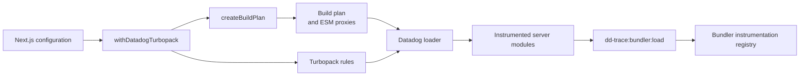

# Turbopack instrumentation

The Turbopack integration instruments server-side dependency modules during a Next.js build.
It keeps target discovery and source analysis outside the application request path.

This document describes the internal implementation. See the [root README](../../README.md#bundling) for setup instructions.

## Architecture

`withDatadogTurbopack` connects the configuration phase and the build phase.
The configuration phase creates immutable artifacts and Turbopack rules.
The build phase transforms only the modules that match these rules.
The generated modules publish their exports when the application loads them.

## Configuration phase

`withDatadogTurbopack` normalizes the supplied Next.js configuration.
It resolves Next.js from the application project directory.
It preserves existing Turbopack settings and appends the Datadog rules.
Repeated wrapping does not add the Datadog loader again.

`createBuildPlan` loads the existing Datadog instrumentation declarations.
It finds installed packages that match these declarations.
It resolves package entry points with the Node.js `import` and `require` conditions.
It also records relative target files for integrations that instrument files below a package root.

The planner hashes each target source file.
It creates export setters and proxies for successful ESM targets.
It writes the plan and proxies as content-addressed artifacts.
Concurrent configuration calls can safely use the same artifacts.

The plan contains the target metadata and the expected source hashes.
The wrapper passes the plan path and hash to the loader.
The loader rejects plan content that does not match this hash.

## Rule registration

The wrapper selects the rule shape that the detected Next.js release accepts.
It adds direct rules for installed instrumentation targets.
It adds an import-inspection rule when the plan contains an ESM target.
It adds a separate rule for relative targets when the plan contains them.

The direct rules transform known dependency files.
The import-inspection rule finds active edges to planned ESM targets.
The relative rule matches a file by its relative name and source hash.

## Loader phase

Turbopack calls the Datadog loader for each matching server module.
The loader verifies and caches the build plan before it transforms source.
The plan cache and source-hash cache have fixed bounds.

For a direct target, the loader compares the current source hash with the plan.
It skips a changed target because the stored instrumentation data can be stale.
It sends matching source to the shared bundler rewriter and preserves the source map.

The loader adds a guarded publication block to each CommonJS target.
The subscriber can replace the published exports before the module returns them.

An ESM importer cannot replace the imported module namespace.
The loader therefore redirects active edges to a generated proxy.
It uses the Turbopack resolver for each edge.
An `import` edge uses import conditions, and a `require` edge uses require conditions.
This preserves the application resolver behavior and its aliases.

The proxy imports the original module and maintains live export bindings.
The instrumentation subscriber applies changed exports through generated setters.
Type-only TypeScript imports do not create runtime edges.
Node.js built-in modules do not enter edge resolution.

## Runtime publication

`dd-trace/init` installs the bundler subscriber before application modules load.
Generated code gets the shared diagnostic channel through a global symbol.
It uses the native diagnostic channel when the shared channel is not present.

Generated code checks `channel.hasSubscribers` before it creates publication payloads.
A payload identifies the package, version, path, exports, and selected instrumentation entries.
The subscriber checks disabled integrations and version rules before it runs a hook.

For CommonJS, the subscriber updates the payload module.
The generated block then copies the result to `module.exports`.
For ESM, the proxy applies the result to its live bindings.
The subscriber catches and logs hook errors so that they do not stop the application.

## Failure behavior

| Condition | Behavior |
| --- | --- |
| No installed target matches | The wrapper returns the original Next.js configuration. |
| A target cannot produce valid instrumentation data | The planner warns once and omits that target. |
| The plan hash or plan version is invalid | The loader stops the build instead of using invalid plan data. |
| A direct target source hash changed | The loader warns once and skips direct instrumentation for that target. |
| Import parsing, resolver setup, or source generation fails | The loader keeps the original module edges and continues direct target handling. |
| The runtime channel has no subscriber | Generated code does not create payloads or run instrumentation hooks. |

The bounded warning set prevents repeated build warnings for the same failure.
The shared module-format classifier keeps ESM and CommonJS decisions consistent with the other bundler integration.
